# Secure Multi-Tier AWS Cloud Architecture

This is a project I built to actually get hands-on with the kind of AWS architecture that shows up constantly in Solutions Architect interviews and on the SAA exam — a proper multi-tier network with real network isolation, not just spinning up a single EC2 instance and calling it a day.

I built everything manually through the AWS console instead of using Terraform (which I'd already used on a couple other projects) specifically so I'd actually understand every piece — every route table, every security group rule — instead of running `terraform apply` on a module I copied from somewhere.

## What it actually is

A Flask + PostgreSQL API deployed across a real three-tier network:

```
                         Internet
                            |
                     [Internet Gateway]
                            |
                    ┌───────────────┐
                    │ Public Subnet │   (just routing, nothing lives here)
                    └───────────────┘
                            |
                    [NAT Gateway]
                            |
        ┌───────────────────┴───────────────────┐
        │                                         │
┌───────────────┐                        ┌───────────────┐
│ App Subnet A   │  us-east-1a            │ App Subnet B   │  us-east-1b
│ EC2 (in ASG)   │                        │ EC2 (in ASG)   │
└───────────────┘                        └───────────────┘
        │                                         │
        └───────────────────┬─────────────────────┘
                             │
                    ┌────────────────┐
                    │ DB Subnet      │   (isolated, no internet route)
                    │ RDS Postgres   │
                    └────────────────┘
```

- **Public subnet** — literally nothing runs here except the NAT Gateway. It's just the traffic cop for outbound internet access.
- **App subnets (2 AZs)** — EC2 instances running the Flask API, sitting in an Auto Scaling Group so the compute tier survives an instance (or even a whole AZ) going down.
- **DB subnet** — RDS Postgres, completely isolated. No route to the internet at all, and it only accepts traffic from the app tier's security group.
- **VPC Interface Endpoints** — this is how the app instances talk to AWS Systems Manager without ever touching the public internet.

## The decisions and why I made them

**No SSH, anywhere.** Every instance is managed through Systems Manager Session Manager instead. That means no key pairs to lose track of, no port 22 open to the world, and every session is logged through IAM instead of "whoever has the .pem file."

**Security groups are tiered, not flat.** The DB security group only accepts Postgres traffic from the app tier's security group — not from a CIDR range, not from "anywhere," specifically from the other security group. Same logic on the app tier: nothing gets in except through the intended path.

**Auto Scaling Group spans two AZs.** This is the actual reason the compute tier can lose an entire Availability Zone and keep running.

**RDS is single-AZ, not Multi-AZ.** This one I want to be upfront about — I did NOT do this because I ran out of budget or forgot. This app has basically zero real traffic (it was a fake API for testing, not something with real users), so Multi-AZ RDS would be solving a problem that doesn't exist for this workload. I kept the compute tier multi-AZ specifically to practice that pattern, but for the database I made the call that matches what I'd actually recommend if someone asked me "does this need Multi-AZ" — no, not at this scale. If this were a real production app with real traffic, Multi-AZ RDS plus an Application Load Balancer in front of the ASG would be the first two things I'd add.

Being honest about that tradeoff is kind of the point of the project — a lot of student projects just throw every AWS service at something to look impressive, and I'd rather show that I know when a pattern is actually load-bearing versus when I'm using it to practice.

## How I actually proved the isolation works

I didn't just assume the network was locked down because the security group rules looked right on screen — I tested it:

- Tried hitting the app tier's private IP directly from my laptop → connection timed out, exactly what should happen since there's no route in
- Tried hitting the RDS endpoint directly from outside the VPC → refused
- SSM'd into an app instance and hit the API locally → worked fine, and the API successfully read/wrote to the database

That last point matters — it's not enough to prove things are blocked, you also have to prove the thing that's *supposed* to work still works.

## Stack

AWS (VPC, EC2, Auto Scaling, RDS/Postgres, IAM, Systems Manager, NAT Gateway, VPC Endpoints, Security Groups), Python, Flask, SQLAlchemy

## Screenshots

### Getting the app running locally first (Phase 0, before touching AWS)

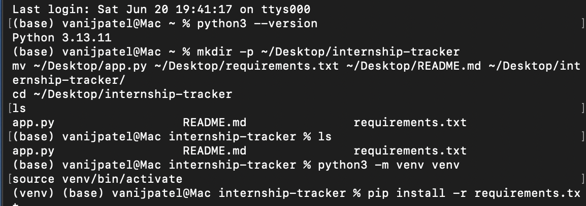
Set up the project folder, virtual environment, and installed dependencies — got this working end-to-end on SQLite before deploying anything to AWS.

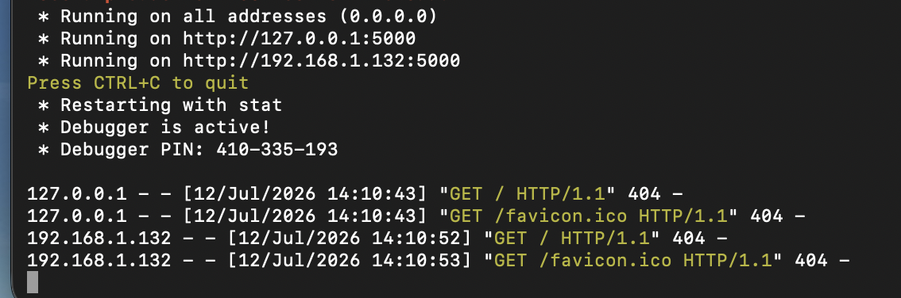
Local dev server up and responding.

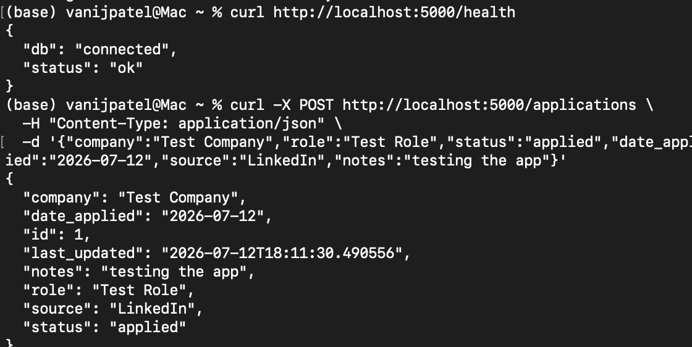
Health check confirms the app can talk to its database, then created the first test application through the API.

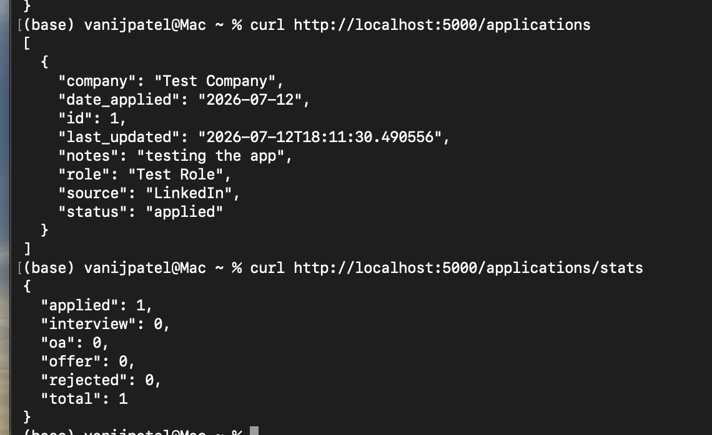
Confirmed listing and stats endpoints work before moving to AWS.

### The actual AWS network

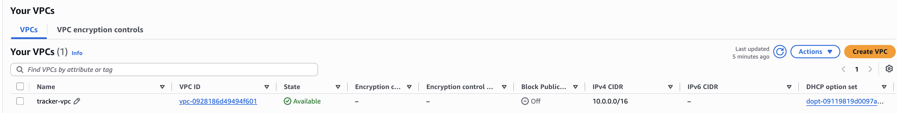
The VPC itself — `tracker-vpc`, `10.0.0.0/16`.

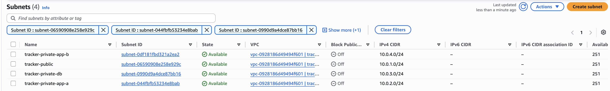
All 4 subnets: public, two private app subnets split across `us-east-1a`/`us-east-1b`, and the isolated database subnet.

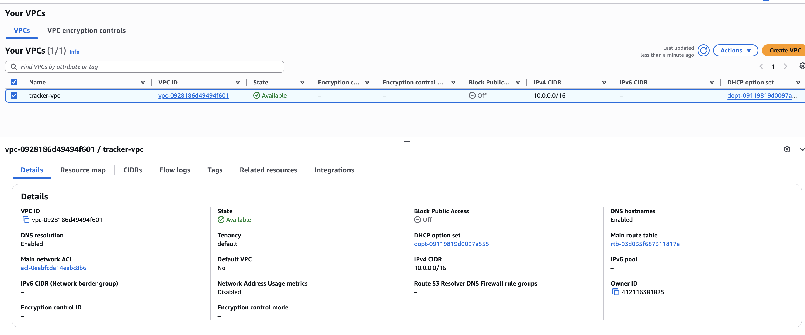
Full VPC configuration — DNS resolution and hostnames enabled (needed for the VPC endpoints to work).

### Routing

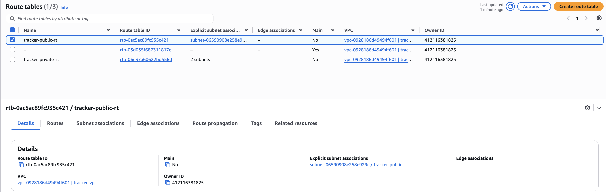
Public route table, associated with the public subnet only.

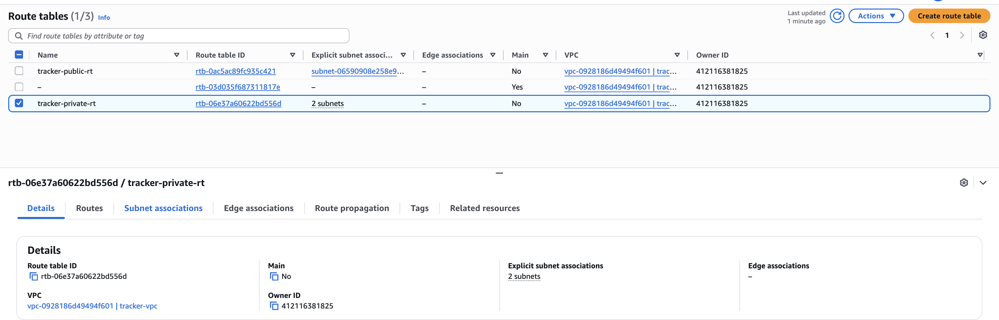
Private route table, associated with both app subnets.

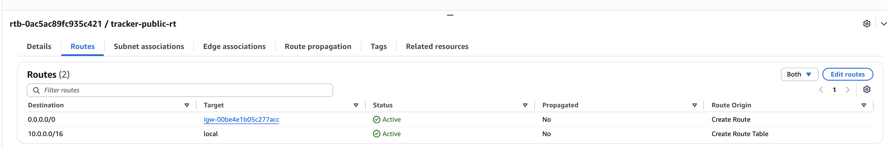
The public route table's actual route: `0.0.0.0/0` → Internet Gateway.

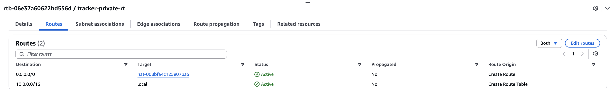
The private route table's actual route: `0.0.0.0/0` → NAT Gateway. This is what lets the app tier reach the internet for package installs without being reachable from it.

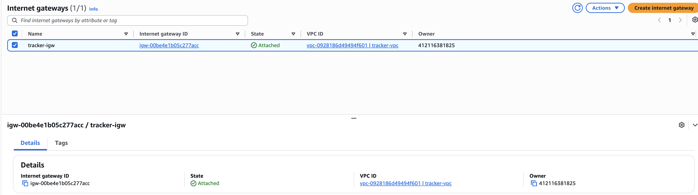
Internet Gateway attached to the VPC.

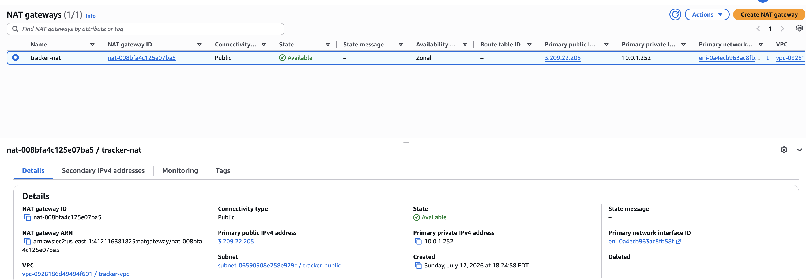
NAT Gateway, sitting in the public subnet, is the only thing giving the private subnets outbound access.

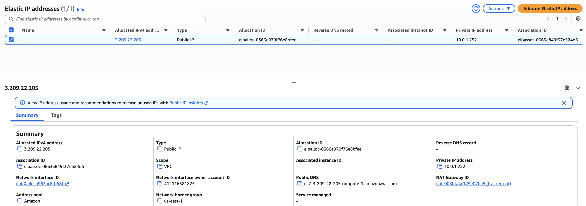
The Elastic IP tied to the NAT Gateway.

### Security groups — the actual access control

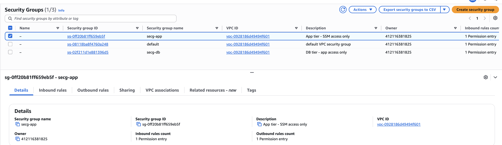
`secg-app` — App tier, SSM access only. No SSH rule exists here at all.

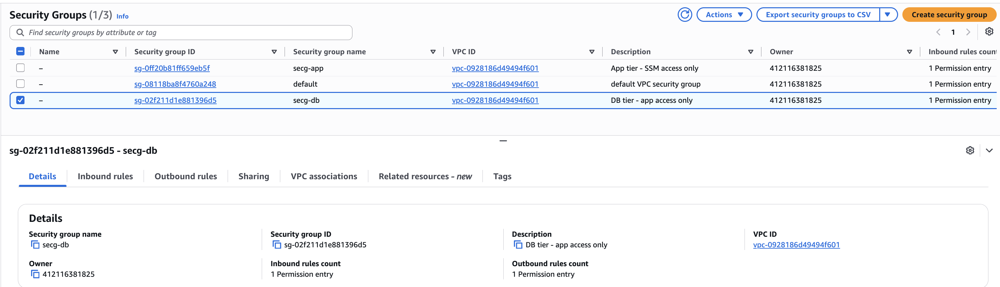
`secg-db` — DB tier, only accepts traffic from the app tier's security group specifically, not a CIDR range.

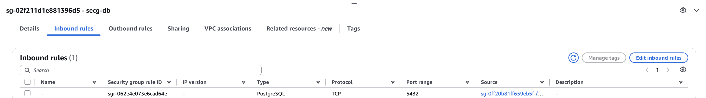
The actual rule on `secg-db`: PostgreSQL, port 5432, source is `secg-app` specifically — not a CIDR block, not "anywhere."

### Compute and database configuration

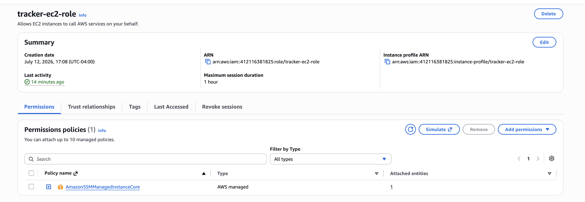
The launch template — `t3.micro`, the AMI, and the app-tier security group attached.

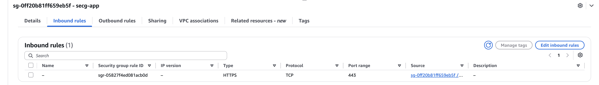
`tracker-asg` — 1/1 healthy, spanning both `us-east-1a` and `us-east-1b`.

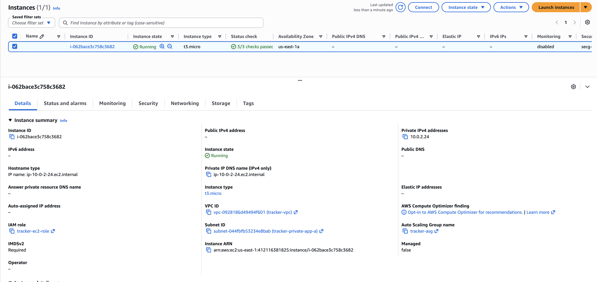
The ASG's actual network config, confirming it's tied to both private app subnets — this is what makes it genuinely multi-AZ instead of just claiming to be.

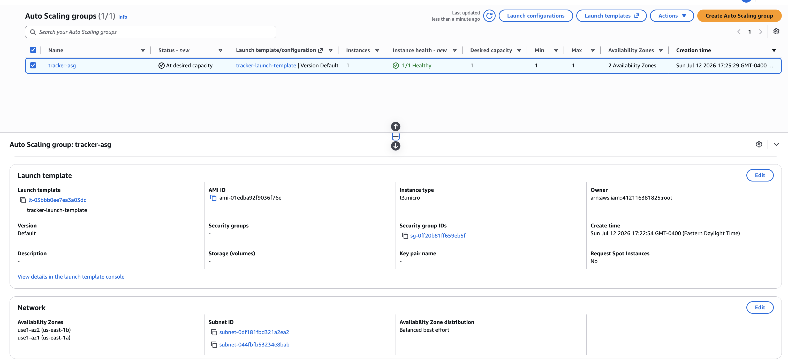
The running instance itself — private IP only, no public IPv4, IAM role attached, tied back to the ASG.

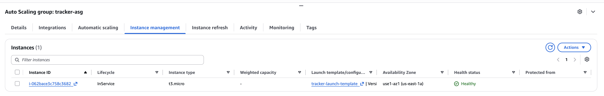
`tracker-ec2-role` — exactly one permission policy attached: `AmazonSSMManagedInstanceCore`. Nothing else. This is the actual enforcement behind "no SSH, least privilege."

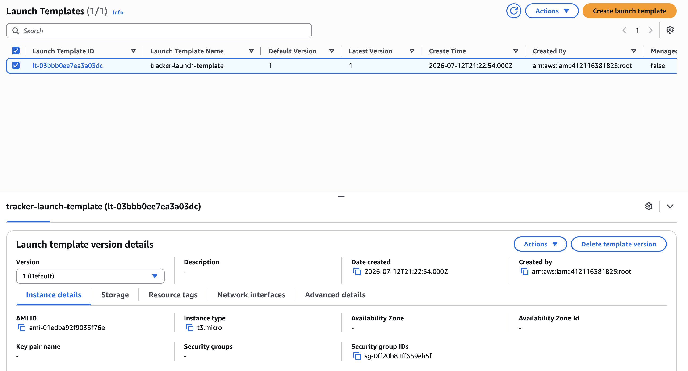
RDS connectivity config — no public endpoint, security group locked to `secg-db`, IAM DB auth intentionally left off since Systems Manager handles access control at the network layer instead.

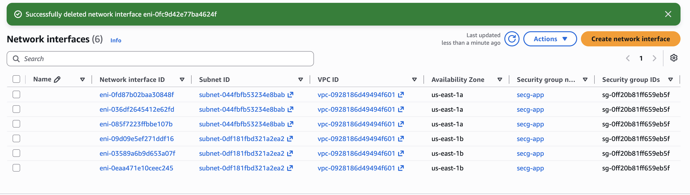
Full instance configuration — `db.t3.micro`, PostgreSQL, single-AZ (the documented cost/availability tradeoff), 20 GiB storage.

### Proof it actually works (and that it's actually isolated)

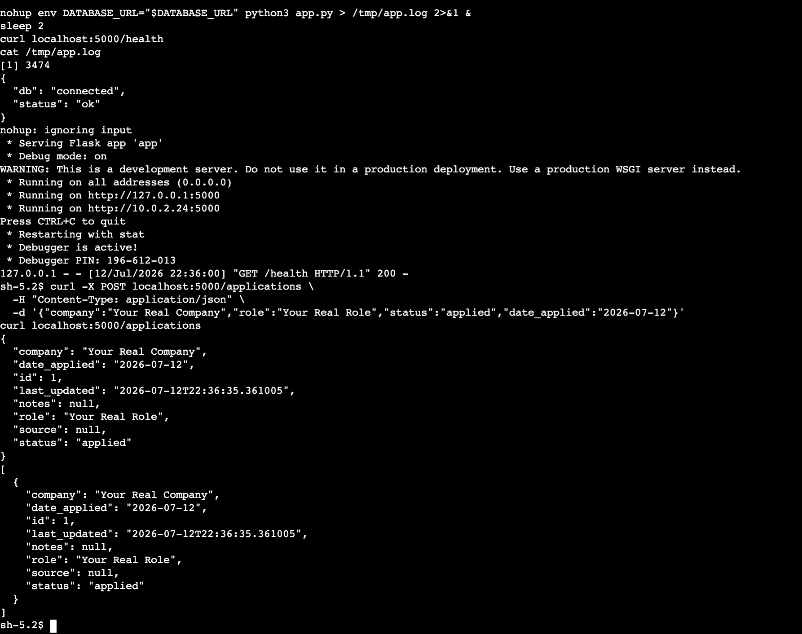
Connected through Session Manager (no SSH), started the app pointed at RDS, health check confirms the database connection, then added and retrieved a real application through the API — the intended path works end to end.

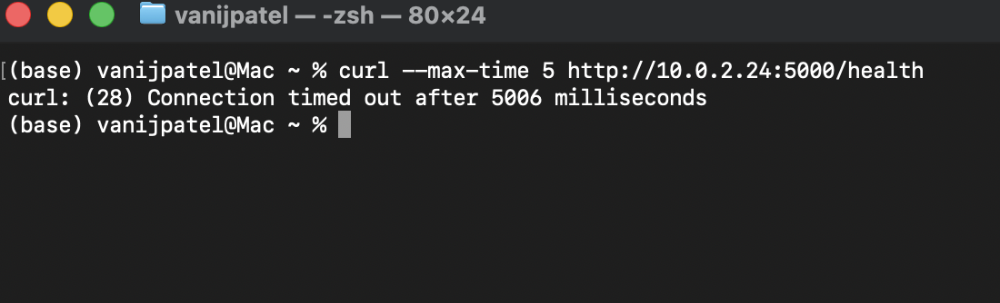
From my own laptop, outside the VPC entirely, trying to hit the app tier directly times out. This is the proof that isolation isn't just theoretical — it's the single most important screenshot in this whole project.

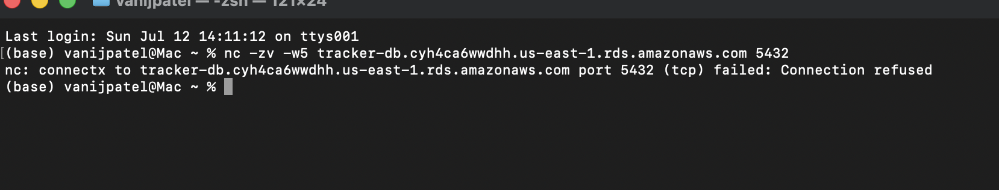
Same test against the database directly — connection refused.

## Teardown

Everything here was built and torn down in the same sitting to avoid leaving anything running and racking up cost — NAT Gateway and Elastic IP first (most expensive), then the ASG, RDS, VPC endpoints, security groups, route tables, IGW, subnets, and finally the VPC itself. Double-checked with the AWS CLI afterward that nothing was left behind.

## Notes

The Flask API layer was scaffolded with AI assistance since the focus of this
project was the AWS architecture, not the application code. I designed, built,
debugged, and tore down the entire infrastructure manually through the AWS
console.
